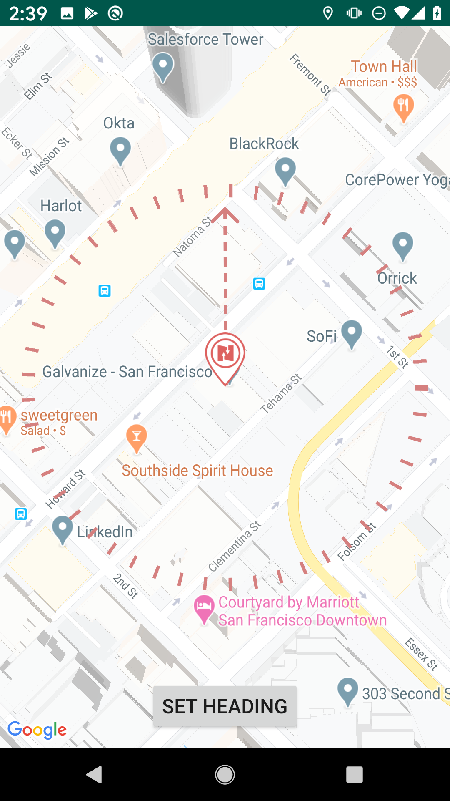

# Manual Location Example #

This is an Example App to demonstrate setting a location manually with the Navisens MotionDNA SDK for Android.

### Requirements
- Google Maps API Key (can be acquired [here](https://developers.google.com/maps/documentation/android-sdk/get-api-key))
- MotionDNA Developer Key (can be acquired [here](https://www.navisens.com/#contact))

